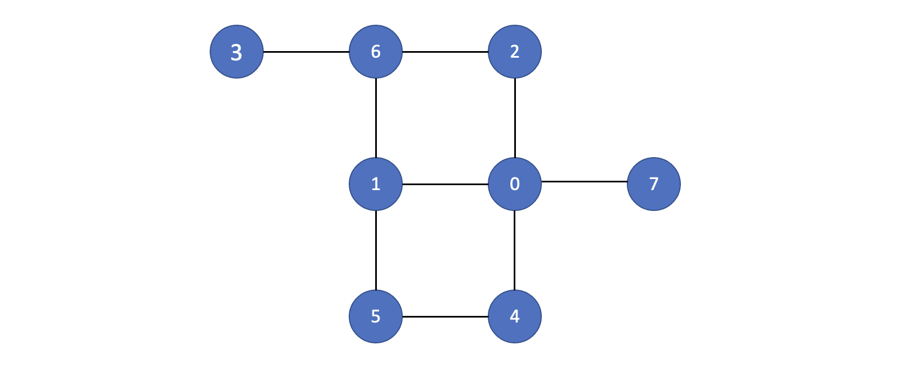

# Graph Note
> 在此討論的graph，我定義為廣義的graph problem，因為adjacent-list需要自己計算，還有edge會有**權重**和**方向性**的時候; 相比於2d-array的題目就不用考慮adjacent list（只有上左右跟界外），權重都為1，在此我自己區分為general-dfs/ bfs.
####    What is Graph?
- Consisting of vertices and edges.
- Vertices: the fundamental units of the graph. Sometimes, vertices are also known as **vertex** or **node**.
  - *format on leetCode*: ``[node1, node2, node3]``
- Edges: indicate a symmetric relationship between their ends(vertices), **directed** or **undirected**. 
  - *format on leetCode*: ``[[src1, dest1], [src2, dest2]]``
- Important traits:
    1. A graph with no **cycles** is called a **tree**. A tree is an **acyclic**(非循環) connected graph.
    2. A **path** is a sequence of adjacent vertices with no repeated ones.
    3. A **cycle** is a path where first and last vertices are the same.
    4. **DAG**: directed acyclic graph (directed graph with no cycles).
    5. **Bipartite graph**: A graph whose vertices can be divided into **two** sets such that all edges connect a vertex in one set with a vertex in the other set
       (兩群點之間必有相鄰，同群點之間必不相鄰). ex: [coloring problems](https://leetcode.com/problems/possible-bipartition/solutions/213114/The-classical-graph-problem-%222-Coloring-Problem%22-solved-using-DFS/)

####    How are these represented?
- Adjacency List (mostly used)
- Adjacency Matrix

####    Types of traversal (or search)
1. **DFS**: depth first search (like ***pre-order*** in tree)
2. **BFS**: breadth first search (like ***level-order*** in tree)

####    Comparisons
- DFS has **lower memory** because it's not required to store all of the child pointers at each level.
- Solutions at low depth: *BFS*
- Solutions at maximum depth: *DFS*

| Applications                                         | DFS | BFS |
|:-----------------------------------------------------|:---:|:---:|
| Spanning forest, connected components, paths, cycles |  ✅  |     |
| Shortest paths                                       |     |  ✅  |
| Minimal use of memory space                          |  ✅  |     |
***

###  Basic Concepts
  Given ``n`` nodes labeled from ``0`` to ``n-1`` and a list of undirected edges (``n=8``, ``adjList``):
  
####  DFS 
1.  Recursively:
    ```js
    // ...
    
    const dfsRecursive = start => {
      // O(V + E)
      const path = [];
      const visited = {};
      
      // visited都是在node進去dfs裡才會紀錄
      // 進stack則是，node進去，visited也要同步紀錄
      const dfs = node => {
          if (node === undefined || node === null) return;
      
          visited[node] = true;
          path.push(node);
      
          for (let neighbor of adjList[node]) {
            if (!visited[neighbor]) dfs(neighbor);
          }
      };
      
      dfs(start);
      return path;
    };
    
    // start traversal from node 3
    // 3, 6, 2, 0, 1, 5, 4, 7

    dfsRecursive(3);
    ```
2.  Iteratively:
    ```js
    // ...
    
    const dfsIterative = start => {
      // O(V + E)
      const stack = [];
      const visited = {};
      const path = [];
    
      // init
      stack.push(start);
      visited[start] = true;
    
      while (stack.length > 0) {
      const pop = stack.pop();
      path.push(pop);
    
        for (let neighbor of adjList[pop]) {
          if (!visited[neighbor]) {
            visited[neighbor] = true;
            stack.push(neighbor);
          }
        }
      }
    
      return path;
    };
    
    // start traversal from node 3
    //  3, 6, 1, 0, 7, 4, 5, 2
    dfsIterative(3);
    ```
####  BFS 
1.  Iteratively:
    ```js
    // ...
    
    const bfsIterative = start => {
      // O(V + E)
      const queue = [];
      const visited = {};
      const path = [];
    
      // init
      // 進queue時，visited也要同步更新紀錄
      queue.push(start);
      visited[start] = true;
    
      while (queue.length > 0) {
        const shift = queue.shift();
        path.push(shift);
    
        for (let neighbor of adjList[shift]) {
          if (!visited[neighbor]) {
            // 進queue, visited更新，是一組的動作
            visited[neighbor] = true;
            queue.push(neighbor);
          }
        }
      }
    
    return path;
    };
    
    // start traversal from node 3
    // 3 6 2 1 0 5 4 7
    bfsIterative(3);
    ```

##  Questions
### Types
1. [**Bipartite Graph**](./bipartite-graph)
   1. [LeetCode 785. Is Graph Bipartite?](https://leetcode.com/problems/is-graph-bipartite/) ``medium``
   2. [LeetCode 886. Possible Bipartition](https://leetcode.com/problems/possible-bipartition/) ``medium``
   
2. [**Weighted Graph**](./weighted-graph)
   1. [LeetCode 399. Evaluate Division](https://leetcode.com/problems/evaluate-division/) ``medium``
   2. [LeetCode 787. Cheapest Flights Within K Stops](https://leetcode.com/problems/cheapest-flights-within-k-stops/description/) ``medium`` it looks basic but **hard**