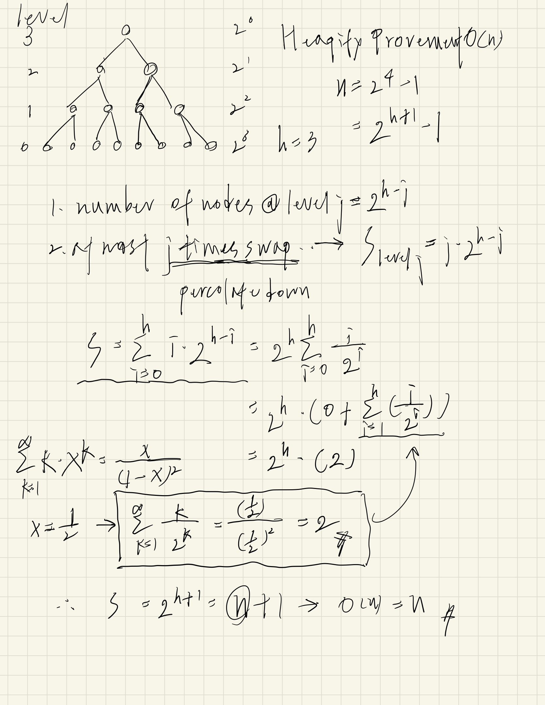
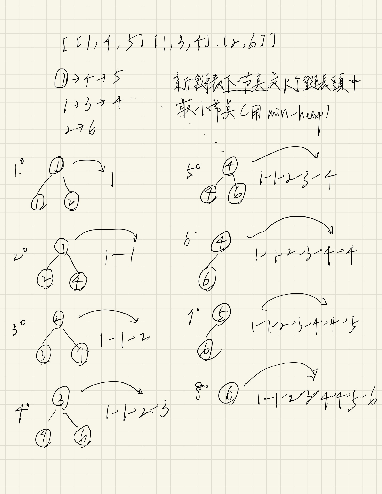

# Binary Heap (Priority Queue) Note
####    What is a heap?
A heap is a **binary tree** with two properties in terms of:
1. **Order**: The value of a node must be >= (or <=) than the values of its children.
2. **Shape**: Must be a *complete binary tree* (every level except the last, is completely filled, and all nodes in the last level are as far left as possible).

####    Why heap?
It's the most efficient way to implement a **priority queue** (insert & delete``log(n)``).

####    How are these represented?
Use an **array** (0-indexed) and get index *i*:
> - 用sorted array是最簡單直接的方式來達到priority queue，但insertion是*O(n)*，每個element進來就排序;
> - 用array ＋ heap特性實作priority queue (array 變成partially sorted)，insertion是*O(log(n))*，每個element進來最多是比較樹高次數。
1. parent index: floor((*i* - 1) / 2)
2. left child index: *i* * 2 + 1
3. right child index: *i* * 2 + 2

####    Tricky part: why heapifying the array ``O(n)``?
> - 直覺會覺得是``O(nlog(n))``，每個點進來排``log(n)`` ，共n個點，錯的。
> - 想法：用percolate down，所有的leaf node就不用考慮，因為他下面沒有層了（直接省掉對node最多的level計算次數），然後一路往上層走，到最頂端root node，只有他需要做到``log(n)``，所以時間複雜度其實是比``O(nlog(n))``小的，答案是``O(n)``。

Proof1: $$S = \sum_{i=0}^h 2^i(h - i)$$ $$S = h + 2(h - 1) + 4(h-2) + 8(h - 2)+...+2^h$$ $$2S-S = (2^{h+1} - 1)-(h-1) = n - h + 1$$ \
Note:  $$n = 2^{h+1} - 1$$

proof2: 
> - 就是求樹裡每個點高度的總和



###  Usage
1.  Dijkastra's algorithm.
2.  Finding K'th largest / smallest element.


###  Operations
We need to adjust the locations of the nodes to fit the heap property, the process is called *heapifying*. \
Heapifying the element from *top to bottom* / *bottom to top* is called *percolate down* / *percolate up*.

0. Setup 
```js
class MaxHeap {
  constructor(type) {
    this.values = [];
  }

  getParent(idx) { return Math.floor((idx - 1) / 2) }

  getLeftChild(idx) { return idx * 2 + 1 }

  getRightChild(idx) { return idx * 2 + 2 }

  swap(idx1, idx2) {
    let temp = this.values[idx1];
    this.values[idx1] = this.values[idx2];
    this.values[idx2] = temp;
  }

  peek() { return this.values[0] }

  show() { return this.values }

  // methods need to implement as below
  insert(ele) {...}

  extract() {...}

  heapify(arr) {...}

  _bubbleUp() {...}

  _trickleDown(idx) {...}
}
```
<details>
    <summary>1.  Percolate (trickle) down</summary>

```js
// ...in class

// this method will put the idx to the correct posotion down to the leaf
// O(logN): tree height down to the leaf, worst case

_trickleDown(idx) {
  let leftChildIdx = this.getLeftChild(idx);
  let rightChildIdx = this.getRightChild(idx);
  let len = this.values.length;

  // our purpose is to assign the max value's index to swapIdx
  let swapIdx = idx;

  //  check whether leftChildIdx exists in bound & left > cur
  if (
    leftChildIdx < len &&
    this.values[leftChildIdx] > this.values[swapIdx]
  ) {
    swapIdx = leftChildIdx;
  }

  //  check whether rightChildIdx exists in bound & 
  //  compare to left or cur
  if (
    rightChildIdx < len &&
    this.values[rightChildIdx] > this.values[swapIdx]
  ) {
    swapIdx = rightChildIdx;
  }

  // if the largest index is not the parent index, need to swap
  if (swapIdx !== idx) {
    this.swap(idx, swapIdx);
    // recursively move down the heap
    this._trickleDown(swapIdx);
  }
}
```
</details>

<details>
    <summary>2.  Extract</summary>

```js
// ...in class

// O(logN): tree height

extract() {
  if (this.values.length === 0) return;
  
  this.swap(0, this.values.length - 1);
  let max = this.values.pop();
  this._trickleDown(0);
  return max;
}
```
</details>

<details>
    <summary>3.  Percolate (bubble) up</summary>

```js
// ...in class

// this method will put the idx to the correct posotion up to the root
// O(logN): tree height up to the root, worst case

_bubbleUp() {
  let curIdx = this.values.length - 1;
  let parentIdx = this.getParent(curIdx);

  // while we haven't reached the root node
  // we keep swap the cur and its' parent when
  // the cur is greater than its parent node
  while (this.values[curIdx] > this.values[parentIdx] && curIdx > 0) {
    this.swap(curIdx, parentIdx);
    // move up the binary heap
    curIdx = parentIdx;
    parentIdx = this.getParent(curIdx);
  }
}
```
</details>

<details>
    <summary>4.  Insert</summary>

```js
// ...in class

// O(logN): tree height up to the root

insert(ele) {
  this.values.push(ele);
  this._bubbleUp();
}
```
</details>

<details>
    <summary>5.  Heapify</summary>

```js
// ...in class

// O(N): amazing

heapify(arr) {
  if (!Array.isArray(arr)) return -1;

  const lastParentIdx = this.getParent(arr.length - 1);
  this.values = arr;

  // from last leaf's parent to the root node 
  for (let i = lastParentIdx; i >= 0; i--) {
    this._trickleDown(i);
  }

  return this.values;
}
```
</details>

###  Questions
### Classics
1.  [LeetCode 215. Kth Largest Element in an Array](https://leetcode.com/problems/kth-largest-element-in-an-array/) ``medium`` 
2.  [LeetCode 347. Top K Frequent Elements](https://leetcode.com/problems/top-k-frequent-elements/description/) ``medium`` (3 methods)
- Strategy of K'th largest problem:
> 1. Heap (nlogk): 求前k大就用min heap(因為值越大就會沉在heap的底部)，保證min heap的size不超過k個，超過就踢除最小值(extract):要先讓element進去排序，超過長度才踢掉計算完後的最小值。可以想像校排成績前100這類的問題: 台大只錄取前100名(k=100)，heap size=100，第101個進來後重新排序，算出最小值再把他踢除。
> 2. quick select (best: O(n), worst: O(n^2))
> 3. bucket sort O(n)

- ex #215:
```js
//...

var findKthLargest = function(nums, k) {
  
  const minHeap = new Heap('min');

  for (const ele of nums) {
    // 不管如何，先進去排序
    minHeap.insert(ele);
    if (minHeap.values.length > k) {
      // 如果超過容量，剔除最小值
      minHeap.extract()
    }
  }
  // heap頂部就是第k大的值
  return minHeap.peek();
};
```

### Non-intuitive
1.  [LeetCode 253. Meeting Rooms II](https://aaronice.gitbook.io/lintcode/sweep-line/meeting-rooms-ii) ``medium``: interesting
1.  [LeetCode 23. Merge k Sorted Lists](https://leetcode.com/problems/merge-k-sorted-lists/) ``hard``: very common
- ex #253:
```js
/*
  Meeting Rooms II
  priority queue(min heap):  O(nlogn)
  想法：利用min heap存下正在開會的meeting room，heap比較基準為end time(peek 就是最結束數的會議)
  
  steps:
    1. 先從小到大排序start time: [[0, 30], [5, 10], [15, 20]]
    2. 迭代排序好的intervals: 
        i. 只要heap裡不為空，而且heap的peek值(end time)小於等於 迭代的start time，表示不用再多一個會議室，extract
        ii. 如果為否，insert進heap(多一間會議室)
 */
const minMeetingRooms = intervals => {
  const minHeap = new Heap('min');
  
  intervals.sort((a, b) => a[0] - b[0]);
  
  for (const interval of intervals) {
    if (minHeap.values.length > 0 && minHeap.peek[1] <= interval[0]) {
      minHeap.extract();
    }
    minHeap.insert(interval);
  }
  return minHeap.values.length;
}
```
- ex #23:  


```js
/*
  1. using min heap
  2. 新鍊錶下一個節點，必定是k個鍊錶表頭中最小節點
 */

var mergeKLists = function(lists) {
  const minHeap = new Heap('min');
  const nullNode = new ListNode(null);
  let p = nullNode;

  for (let firstNode of lists) {
    if (firstNode) minHeap.insert(firstNode)
  }

  while (minHeap.values.length > 0) {
    const pop = minHeap.extract();
    p.next = pop;
    p = pop;

    if (pop && pop.next) minHeap.insert(pop.next)
  }

  return nullNode.next;
};
```