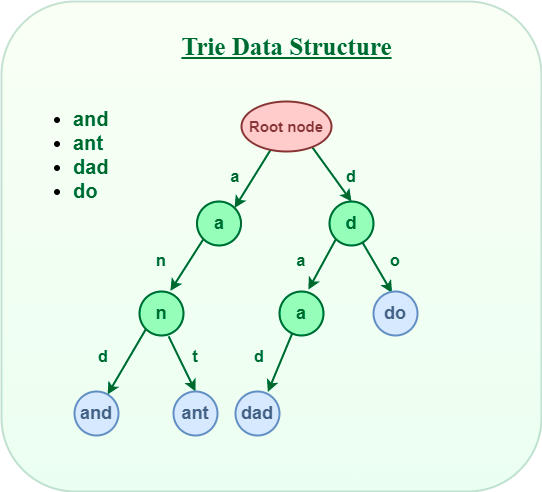

# Trie
#### What is trie?
A trie (pronounced "try") is a tree-like data structure used to efficiently store and retrieve a large set of _strings_, typically words, or keys that can be represented as character sequences. The term "trie" stands for "retrieval," and it is short for "reTRIEval."

Tries are particularly useful for tasks like searching for words in a dictionary, autocomplete suggestions, spell checking, and IP routing. They provide fast data retrieval, making them more efficient than other data structures like hash tables or binary search trees for certain tasks.

#### Why trie?
Efficient Prefix Searching (or auto-complete)
- Searching for a String even in the large collection of strings in a Trie data structure can be done in `O(L)` Time complexity, Where `L` is the number of words in the query string. This searching time could be even less than `O(L)` if the query string does not exist in the trie.


#### Key props of Trie
1. There is one `root` node in each Trie.
2. Each node of a Trie represents a _string_ and each edge represents a _character_.
3. Every `node` consists of:
   1. Hashmaps or an array of pointers, with each index representing a character
   2. A flag to indicate if any string ends at the current node.
4. Trie data structure can contain any number of characters including alphabets, numbers, and special characters. But for here, we will discuss strings with characters a-z. Therefore, only 26 pointers need for every node, where the `0-th` index represents ‘a’ and the 25th index represents ‘z’ characters.
5. Each path from the root to any node represents a word or string.



reference: [Introduction to Trie – Data Structure and Algorithm Tutorials](https://www.geeksforgeeks.org/introduction-to-trie-data-structure-and-algorithm-tutorials/)
***
### Data structure
key: 其實就是廣義的tree，有26個小孩（一般tree只有左右小孩），然後有一個flag表示這個節點組成的string是不是一個單位。
1. basic class block
```js
class TrieNode {
  constructor() {
    this.children = new Array(26)
    this.isEnd = false  
  }
}

const Trie = function() {
  this.root = new TrieNode()
}

// basic methods
Trie.prototype.insert = function(word) {...}
Trie.prototype.search = function(word) {...}
Trie.prototype.startsWith = function(word) {...}

// some tricks
// using let charCode = char.charCodeAt(0) - 'a'.charCodeAt(0) to indicate index in child array 
```
2. DFS (想好recursive的return值是什麼)
   - searching (dots `.` where dots can be matched with any letter)
```js
...

WordDictionary.prototype.search = function(word) {
    const dfs = (node, idx) => {
        if (!node) return false
        if (idx === word.length) return node.isEnd

        let char = word[idx]
        let codeAt = char.charCodeAt(0) - 'a'.charCodeAt(0)
        if (char === '.') {
            for (const childNode of node.children) {
                if (dfs(childNode, idx + 1)) return true
            }
        } 
        return dfs(node.children[codeAt], idx + 1)
    }

    return dfs(this.root, 0)
}
```
####    Basics
*must*:
1. [208 Implement Trie (Prefix Tree)](https://leetcode.com/problems/implement-trie-prefix-tree/)
2. [211 Design Add and Search Words Data Structure](https://leetcode.com/problems/design-add-and-search-words-data-structure/)
